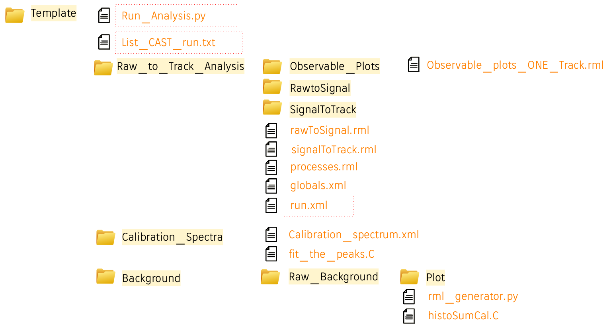

# Description

!!! Documentation not complete.

!!! Cross check of the results still ongoing.

This example provides an automatic procedure to compute the raw background calibrated spectrum, starting from a list of CAST data files.
Template.tar.gz contains all the necessary files to perform the analysis that is handled by the python script Run_Analysis.py

#  Run the analysis
Before running the analysis (after uncompressing Template.tar.gz that can be renamed as preferred), the following things must be specified:
- the path where the data are stored in Run_Analysis.py;
- the path of the readout in Raw_to_Track_Analysis/run.xml;
- the file list you want to analyze (inside list_CAST_run.txt).

To run the analysis just run the command:

```python Run_Analysis.py```

The main steps of the script are:
- runs the first part of the analysis (raw to signal);
- runs the second part of the analysis (signal to track);
- generates the observable plots;
- generates the calibration histograms, fit the 3 and 6 keV peak, and store results in a file;
- generates a plot with the 3 and 6 keV peak position as a function of the run number;
- generates the bg histograms;
- computes the calibrated bg spectrum.

CAVEATS:
- the structure of the directories cannot be modified;
- in the file list you want to analyze each calibration file must be placed right after the corresponding background file;
- the histoSumCal.C does not compute correctly the total time yet if the .
- the number of bins fixed (48 bins), such as the energy range (0.4 - 10 keV).

# Directory structure, input and output files


