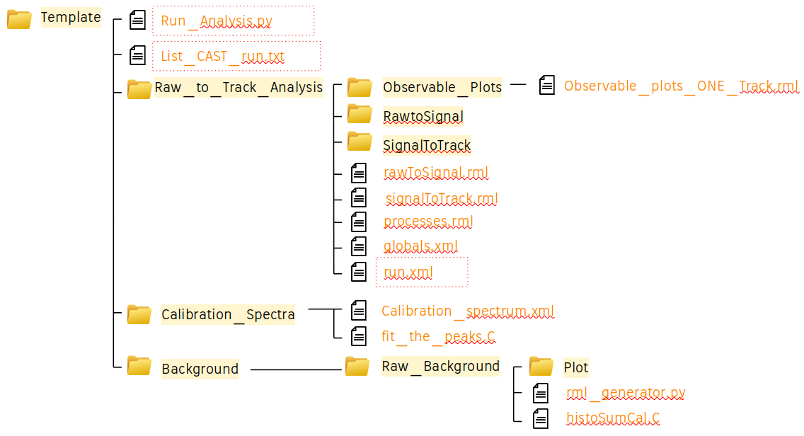
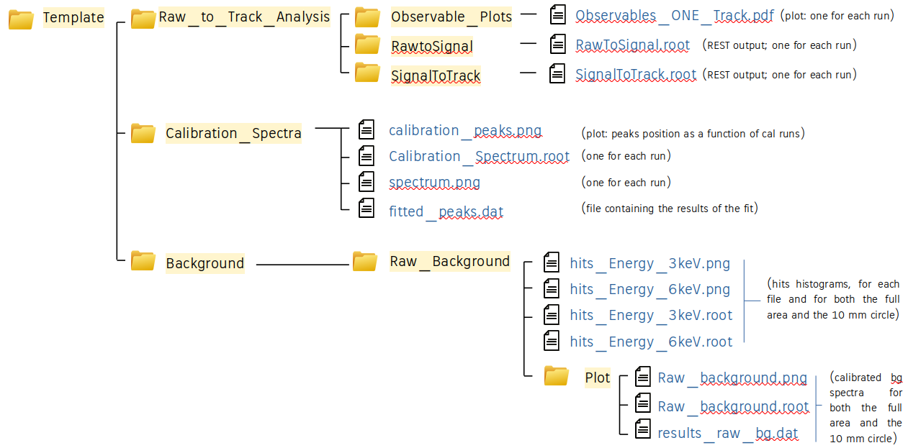

# Description

!!! Documentation not complete.

!!! Cross check of the results still ongoing.

This example provides an automatic procedure to compute the raw background calibrated spectrum (both for the full detector area and the )10 mm inner region), starting from a list of CAST data files.
Template.tar.gz contains all the necessary files to perform the analysis that is handled by the python script Run_Analysis.py

The main steps of the script consist in:
- running the first part of the analysis (raw to signal);
- running the second part of the analysis (signal to track);
- generating the observable plots;
- generating the calibration histograms, fit the 3 and 6 keV peak, and store results in a file;
- generating a plot with the 3 and 6 keV peak position as a function of the run number;
- generating the bg histograms;
- computing the calibrated bg spectrum.

#  Run the analysis
Before running the analysis (after uncompressing Template.tar.gz that can be renamed as preferred), the following items must be specified:
- the path where the raw data are stored (in Run_Analysis.py);
- the path of the readout (in Raw_to_Track_Analysis/run.xml);
- the file list you want to analyze (list_CAST_run.txt).

To run the analysis just run the command:

```python Run_Analysis.py```

The analysis steps are briefly described (providing an example of CAST data analysis) in the presentation CAST_Analysis_Example.pdf


CAVEATS:
- the structure of the directories cannot be modified;
- in the file list you want to analyze each calibration file must be placed right after the corresponding background file;
- the histoSumCal.C does not compute correctly the total time yet if the .
- the number of bins fixed (48 bins), such as the energy range (0.4 - 10 keV).

# Directory structure, input and output files
The following image shows the folder structure once the file Template.tar.gz has been uncompressed. Files in the red dotted box are those needed to be modified by the user following the above mentioned instructions. 



The following image shows the output files.



Files not mentioned in the previous pictures (that appears in the folders at the end of the process) are intermediate files used during the analysis.

